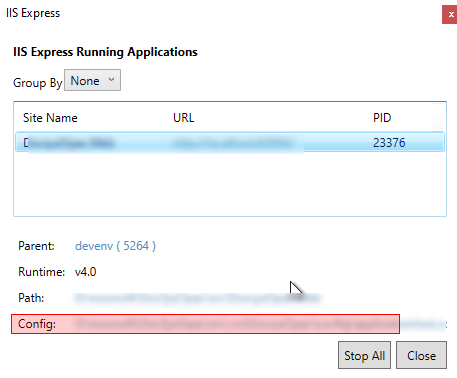

## Open iisexpress url from outside the computer
Open the applicationhost.config which is inside .vs or open it from iisExpress when you run the application 

Search the for bindingInformation and change from *:44444:localhost to  ***:44444:*** (The port may be different)

Then from elevated Dos command run (The port may be different)

      netsh http add urlacl url=http://*:44444/ user=Everyone

[IIS Express – HTTP Error 400. The request hostname is invalid.](https://blog.binarybits.net/iis-express-http-error-400-the-request-hostname-is-invalid/)

Also don't forget to open the port in firewall.
