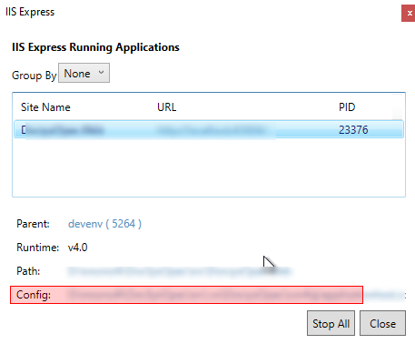

## Enable windows Auth in iisexpress
Open the applicationhost.config which is inside .vs or open it from iisExpress when you run the application 

Search the for windowsAuthentication and enable it
you can also disable anonymousAuthentication
Also enable it in web.config

